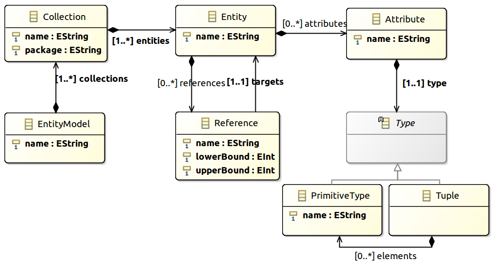

# Tutorial de aspectos básicos y avanzados de Sirius

Este repositorio almacena los proyectos y recursos utilizados para el tutorial **Creación de DSLs gráficos con Sirius** en las **Jornadas sobre Ingeniería del Software y Bases de Datos** (**JISBD**) (https://fg.ull.es/sistedes2017/). La motivación del mismo surge a partir de observar que apenas existen recursos y tutoriales de Sirius en español, y a que los tutoriales oficiales proporcionados en la página principal de Sirius (http://www.eclipse.org/sirius/) son hasta cierto punto triviales. El tutorial se divide en dos apartados:

* Implementación de aspectos básicos en Sirius:
  * Creación de elementos visuales
  * Creación de estilos y condicionales
  * Creación de una paleta de creación de elementos
  * Mecanismos de navegación entre diagramas

* Implementación de aspectos avanzados en Sirius:
  * Operaciones de edición directa
  * Operaciones de reconexión de aristas
  * Filtros
  * Condiciones de validación
  * Servicios Java

## Escenario inicial:

Una instalación de Eclipse Modeling Framework con al menos Java 7 y Sirius actualizado. Para comenzar el tutorial rápidamente, si no tienes esta instalación disponible, descarga Eclipse versión Obeo Designer Community de la siguiente dirección: http://www.eclipse.org/sirius/download.html

A continuación clona este repositorio Git, abre Eclipse e importa los siguientes proyectos básicos:

* `EntityColl`
* `EntityColl.edit`
* `EntityColl.editor`

Estos proyectos contienen el metamodelo básico, necesario para poder crear modelos y vistas asociadas a este metamodelo. En lugar de importar estos proyectos también puedes hacer uso del *Update site* proporcionado en este repositorio. El proyecto es `EntityColl.update.site`.

## Descripción del metamodelo:

El metamodelo de partida para el que se va a definir el DSL gráfico es el siguiente:

<figure>
    
</figure>
 

Este metamodelo de entidades se compone en los siguientes elementos:
* _Collection_: Un modelo contiene de 1 a N elementos de este tipo. Cada elemento tiene dos atributos de tipo cadena de texto.
* _Entity_: Cada _Collection_ contiene de 1 a N _Entities_. Cada elemento de este tipo tiene un atributo de tipo cadena de texto.
* _Attribute_: Cada _Entity_ contiene de 0 a N _Attributes_. Cada elemento tiene un atributo de tipo cadena de texto y un tipo.
* _Type_: Tipo abstracto que puede instanciarse a _PrimitiveType_, con un atributo de cadena de texto, o a _Tuple_, que a su vez es una agrupación de _PrimitiveTypes_.
* _Reference_: Cada _Entity_ contiene de 0 a N _References_. Cada elemento tiene un nombre, una cardinalidad mínima y máxima y una _Entity_ objetivo.

Este metamodelo es una versión simplificada del metamodelo **NoSQLSchema** usado en procesos de inferencia de bases de datos NoSQL para extraer esquemas implícitos en los datos. El proyecto, así como el metamodelo completo, se pueden encontrar en https://github.com/catedrasaes-umu/NoSQLDataEngineering.

## Aspectos básicos en Sirius

El tutorial de aspectos básicos de Sirius será impartido en las jornadas **JISBD** en Julio de 2017. Para diseñar el DSL gráfico es necesario ejecutar una instancia de Eclipse sobre el proyecto `EntityColl`. Esto nos permitirá crear modelos acordes al metamodelo y vistas con Sirius. En la nueva instancia de Eclipse, los proyectos que puedes importar son los siguientes:

* `EntityColl.examples`: Proyecto con un par de modelos de ejemplo acordes al metamodelo _EntityColl_.
* `EntityColl_basics1.design`: Proyecto Sirius con definiciones básicas visuales de un _Diagrama de colecciones_, con el que visualizar los elementos del metamodelo.
* `EntityColl_basics2.design`: Proyecto Sirius construido incrementalmente a partir de `EntityColl_basics1.design`. Además de lo anteriormente comentado, se define una paleta mediante la cual se pueden crear los elementos _Collecion_, _Entity_, _PrimitiveType_, _Tuple_ y _Reference_.
* `EntityColl_intermediate.design`: Proyecto Sirius construido incrementalmente a partir de `EntityColl_basics2.design`. Además de lo anteriormente comentado, se ha definido un _Diagrama de entidades_ con el que centrar la atención en una _Collection_ concreta. En este diagrama se han definido visualizaciones de los elementos y una paleta de creación de elementos.

Por el momento no se dispone de vídeos de demostración para esta parte.

## Aspectos avanzados en Sirius

El tutorial de aspectos avanzados parte del proyecto `EntityColl_intermediate.design`. En él se implementa cierta funcionalidad que, aunque no es estrictamente necesaria para trabajar con el DSL gráfico, proporciona cierta interacción a las vistas desarrolladas. Concretamente se ilustra la utilización de operaciones para implementar operaciones de edición directa, de reconexión de aristas, filtros, validación y llamadas a métodos Java. Para seguir el tutorial se recomienda, de nuevo en la instancia de Eclipse ejecutada anteriormente, importar los siguientes proyectos:

* `EntityColl.examples`: Proyecto con un par de modelos de ejemplo acordes al metamodelo _EntityColl_.
* `EntityColl_intermediate.design`: Proyecto Sirius con la implementación desarrollada en el tutorial de aspectos básicos.
* `EntityColl.design`: Proyecto Sirius construido incrementalmente a partir del proyecto `EntityColl_intermediate.design`. En él se puede encontrar implementada toda la funcionalidad desarrollada en este tutorial, y puede servir como ejemplo de juguete al usuario.

El tutorial se divide en dos vídeos alojados en Youtube. En el primero de ellos se implementan las operaciones de edición directa y reconexión. En el segundo el resto de características:

https://www.youtube.com/watch?v=CBRcB10Qrpw

https://www.youtube.com/watch?v=na_Lxxp8D3M
